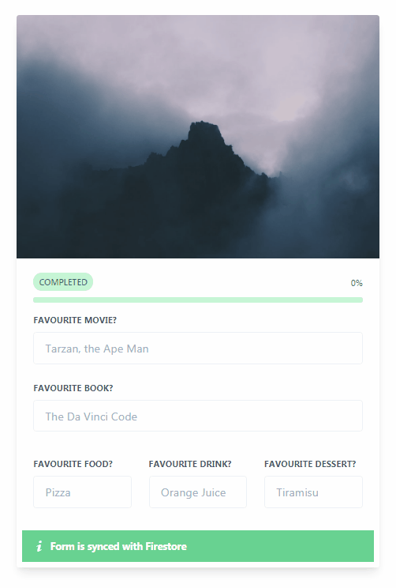

## Introduction

This repo contains the solution for a Vue/Firestore test assignment.

**Test Assignment Description**

Build a form with 5 fields with autosave ability and show the percentage of form completion to the user. Assume each field accounts for 20% of the form.

**Specifics:**

- Use TailwindCSS (tailwindcss.com) for design and UI
- Use Cloud Firestore as database
- Use Vue (https://vuejs.org/) and Vuexfire (https://vuefire.vuejs.org/vuexfire/) to save data in the database

Write a Cloud Function event to calculate form completion percentage in the backend.

**Solution**

My solution was to create a form, and use a debounced input event on it to autosave the form data to a Firestore document. The debounce was needed to reduce the number of requests. Then I used Cloud Functions to create a trigger on the form document, and calculate the completion percentage of the form on every autosave event by counting the number of non-empty fields and saving the result in a different collection and document but with the same ID. I used a different collection to reduce the number of triggers fired. Then I subscribed to the changes of the progress document in the Vue app to display it to the user.

## How to use

 1. **Create a Firebase project**

    cd cloudfunctions/functions
    npm install
    firebase use --add
    firebase deploy

 2. **Edit the vue/src/db.js file and add your Firebase credentials**

    cd vue
    npm install
    npm run serve
